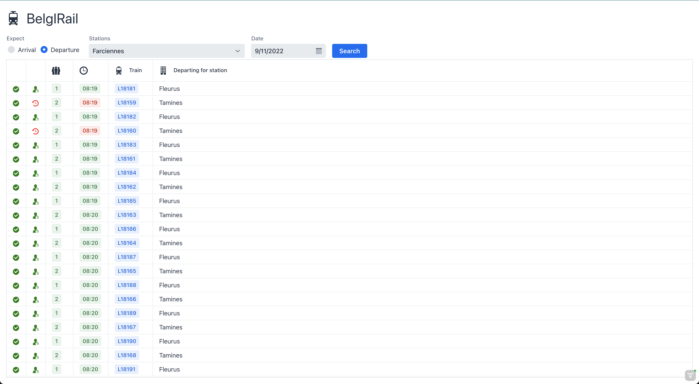

## BelgIRail

##### What is it?
Interface for providing Belgium railway schedules for given station and date. It is consuming [`IRail`](https://github.com/iRail) APIs to fetch information of stations, trains, live dashboard etc. Currently, the application is in very initial phase, more features will be added gradually.

##### How does it look?

It is developed using Vaadin 23 and initial version looks as show in below screenshot.

##### References

- [IRail Documentation](https://docs.irail.be/)
- [Vaadin](https://vaadin.com/docs/latest/)

